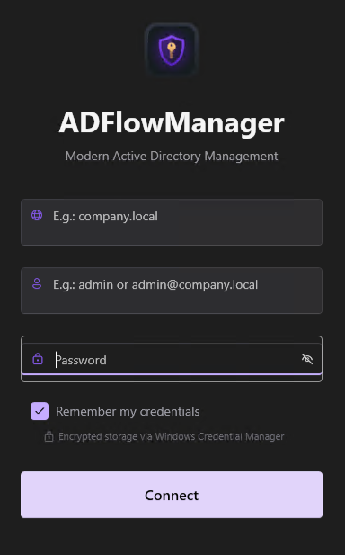
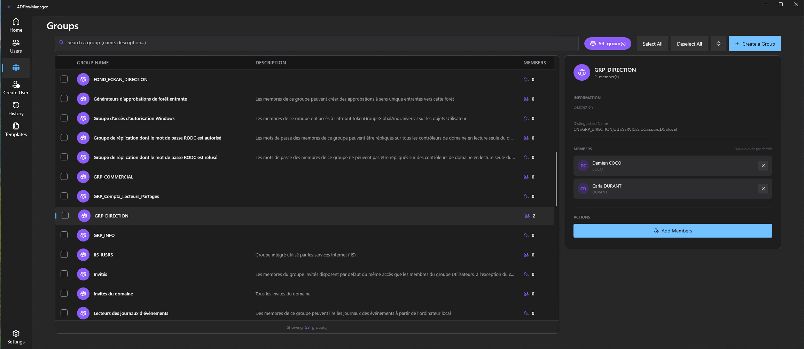
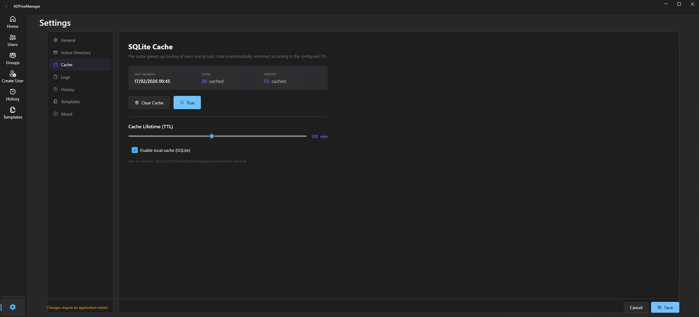

<div align="center">

# ADFlowManager


**Modern Active Directory Management Tool**

Faster AD Management • Modern Interface • Native Performance • Privacy-First • Open Source

[](LICENSE)
[](https://dotnet.microsoft.com/)
[](https://www.microsoft.com/windows)
[](https://github.com/Alex-Bumblebee/ADFlowManager/releases)
[](https://github.com/lepoco/wpfui)

[English](#english) | [Français](#français)

</div>

---

<a id="english"></a>

## English

### Why ADFlowManager?

Managing Active Directory with PowerShell or legacy MMC snap-ins is slow, repetitive, and error-prone. **ADFlowManager** replaces that workflow with a **modern desktop application** that covers the full AD lifecycle — from user onboarding to offboarding, group management, computer monitoring, and even software deployment — all in one place.

- **Full AD Lifecycle** — Create, edit, disable, move, and audit users without touching a single cmdlet
- **Built-in Package Deployment** — Push software to your AD computers directly from the app
- **Team-Ready** — Share templates, audit logs, and packages over a network share
- **Native Performance** — .NET 10 with intelligent SQLite caching, no PowerShell overhead
- **Privacy-First** — Zero telemetry, 100% local data processing, GPLv3 open source

> **v0.3.3-beta** — Active beta. Core features are stable and production-tested. Feedback welcome!

---

### Quick Start

```
1. Download ADFlowManager-Setup.exe from Releases
2. Run the installer (no admin rights required, .NET 10 runtime included)
3. Launch ADFlowManager
4. Enter your AD domain, username, and password
5. Start managing your Active Directory!
```

[](https://github.com/Alex-Bumblebee/ADFlowManager/releases/tag/v0.3.3-beta)

---

### Features

#### User Management

- **Create** users with full property support (General, Contact, Organization)
- **Edit** any user attribute directly from the detail view (5 tabs)
- **Disable / Enable** accounts with automatic OU relocation
- **Reset passwords** with strength indicator and secure generation
- **Copy users** intelligently (copies org data & groups, skips personal info)
- **Compare users** side-by-side and sync rights bidirectionally
- **Copy rights** between users (batch group assignments)
- **Move users** between Organizational Units

#### Group Management

- **Browse** all AD groups with search and filtering
- **Add / Remove** members in bulk
- **Create** new groups (Security or Distribution, any scope)
- **View** group membership at a glance

#### Computer Management

- **Browse** all AD computers with search and filtering
- **Check online status** with live ping directly from the list
- **View** OS, last logon, and enabled/disabled status at a glance

#### Package Deployment

- **Deploy software** to AD computers in a few clicks
- **Batch deployment** — target multiple machines in one operation
- **Deployment results** — per-computer success/failure report
- **Organize packages** by category, version, and installer type
- **Network storage** — share your package library across the team

#### Templates System

- **Create** reusable user templates (job title, department, groups, options)
- **Store** templates locally or on a **network share** for team collaboration
- **Apply** templates during user creation for instant onboarding
- **Import / Export** templates in JSON format

#### Performance

- **Smart SQLite cache** — accelerates repeated queries dramatically
- **Configurable TTL** (60–1440 min) with manual and automatic refresh
- **Native .NET APIs** — bypasses PowerShell overhead entirely
- **Async/await** throughout the application for a responsive UI

#### Audit & Compliance

- **Multi-user audit trail** — tracks every action (create, update, disable, enable, password reset, group changes, OU moves)
- **SQLite database** — local or network-shared for team visibility
- **Filter** by date range, operator, action type, or target entity
- **Export** audit logs to **CSV**
- **Per-user history** visible directly in the User Details window
- **Configurable retention** policy (auto-purge old logs)

#### Internationalization

- **French** (default) and **English** — switchable in Settings
- ~95% coverage in beta; 100% targeted for v1.0.0

#### Modern Interface

- **Dashboard** — real-time stats (users, groups, daily actions) and recent activity feed
- **Dark / Light theme** — respects your saved preference, never overridden by the OS
- **Comprehensive Settings panel** — General, Active Directory, Cache, Logs, Audit, Templates, Packages, About
- **Responsive** and intuitive navigation

#### Security & Privacy

- **Windows Credential Manager** integration — optional "Remember me"
- **Auto-login** support for trusted environments
- **Zero telemetry** — no data ever leaves your infrastructure
- **GPLv3** — fully open source

#### Auto-Update

- **Velopack** integration with GitHub Releases
- **Delta updates** — minimal bandwidth usage
- **Silent background** installation
- Seamless version transitions (beta → stable)

---

### Screenshots

<div align="center">

**Connection**



**Groups Management**



**Settings Panel**



</div>

> More screenshots will be added for the stable release.

To contribute screenshots: save PNGs (1920×1080) in `docs/screenshots/` and open a PR.

---

### Requirements

| Requirement | Details |
|---|---|
| **OS** | Windows 10 (1809+) or Windows 11 |
| **Runtime** | .NET 10 Desktop Runtime *(bundled in installer)* |
| **Network** | Active Directory domain connectivity |
| **Permissions** | Domain user account (admin recommended for full features) |
| **Disk** | ~100 MB |

---

### Build from Source

```bash
git clone https://github.com/Alex-Bumblebee/ADFlowManager.git
cd ADFlowManager
dotnet restore
dotnet build -c Release
```

The startup project is `ADFlowManager.UI`.

---

### Architecture

**Clean Architecture + MVVM**

```
ADFlowManager/
├── ADFlowManager.Core/               # Domain layer
│   ├── Interfaces/Services/           #   Service contracts (IAD, ICache, IAudit, ITemplate…)
│   └── Models/                        #   Domain models (User, Group, Computer, UserTemplate, AuditLog…)
├── ADFlowManager.Infrastructure/      # Data & integration layer
│   ├── ActiveDirectory/Services/      #   AD operations (System.DirectoryServices)
│   ├── Data/                          #   EF Core DbContexts (Cache, Audit) + entities
│   ├── Security/                      #   Windows Credential Manager
│   └── Services/                      #   Cache, Audit, Settings, Template services
├── ADFlowManager.UI/                  # Presentation layer (WPF + MVVM)
│   ├── Views/Pages/                   #   Pages (Dashboard, Users, Groups, Computers, Packages, Create, Templates…)
│   ├── Views/Windows/                 #   Login, Main, UserDetails windows
│   ├── Views/Dialogs/                 #   Dialogs (Compare, CopyRights, ResetPassword, Deployment results…)
│   ├── ViewModels/                    #   Page & window ViewModels (CommunityToolkit.Mvvm)
│   ├── Converters/                    #   XAML value converters
│   └── Resources/                     #   i18n resource dictionaries (FR/EN)
└── ADFlowManager.Tests/              # Unit tests
```

**Key Technologies**

| Component | Technology |
|---|---|
| Framework | .NET 10 (Standard Term Support) |
| UI | WPF + [WPF-UI](https://github.com/lepoco/wpfui) (Fluent Design) |
| MVVM | [CommunityToolkit.Mvvm](https://github.com/CommunityToolkit/dotnet) |
| Database | SQLite via Entity Framework Core |
| AD Integration | System.DirectoryServices.AccountManagement |
| Logging | Serilog (structured, file + console sinks) |
| Credentials | Windows Credential Manager |
| Auto-Update | [Velopack](https://github.com/velopack/velopack) |
| DI | Microsoft.Extensions.DependencyInjection |

**Design Patterns** — MVVM, Dependency Injection, Repository, Observer (INotifyPropertyChanged), Clean Architecture layer separation.

---

### Usage Examples

**Create a User from a Template**
1. Navigate to **Create User**
2. Click **Apply Template** and select a template (e.g., "IT Intern")
3. Fields auto-fill: department, job title, groups, options
4. Enter personal info (first name, last name, username)
5. Set initial password (or generate one)
6. Click **Create** — user is created in AD with all groups assigned

**Compare & Sync Rights**
1. Open a user's detail view
2. Click **Compare with…** and select another user
3. View side-by-side group memberships
4. Sync rights in either direction with one click

**Deploy a Package**
1. Navigate to **Packages**
2. Select a package and choose the target computers
3. Click **Deploy** — results show per-computer success or failure

**Export Audit Logs**
1. Navigate to **History**
2. Set date range and filters (operator, action type)
3. Click **Export CSV** — ready for compliance reporting

---

### Roadmap

**v1.0.0 — Stable Release**
- All critical beta bugs fixed
- 100% i18n coverage (FR/EN)
- Complete documentation (user guide, admin guide)
- Performance benchmarks published

**v1.1.0+**
- CSV/Excel export and import for users & groups
- Advanced search with combined filters (AND/OR)
- Custom configurable reports
- Keyboard shortcuts
- OU management (create, move, rename)
- Naming policies automation

Full roadmap: [ROADMAP.md](ROADMAP.md) *(available at v1.0.0)*

---

### Contributing

Contributions are welcome! Here's how to get involved:

1. **Fork** the repository
2. **Create** a feature branch (`git checkout -b feature/AmazingFeature`)
3. **Commit** your changes (`git commit -m 'Add AmazingFeature'`)
4. **Push** to the branch (`git push origin feature/AmazingFeature`)
5. **Open** a Pull Request

**Ways to contribute**
- **Bug reports** — [Open an issue](https://github.com/Alex-Bumblebee/ADFlowManager/issues/new)
- **Feature requests** — [Start a discussion](https://github.com/Alex-Bumblebee/ADFlowManager/discussions)
- **Translations** — i18n contribution guide coming in v1.0.0
- **Code** — Fork, improve, submit a PR
- **Documentation** — README, wiki, guides
- **UI/UX** — Design improvements and accessibility

Please read [CONTRIBUTING.md](CONTRIBUTING.md) *(available at v1.0.0)* for detailed guidelines.

---

### 🤖 AI-Assisted Development

This project was developed with the assistance of AI tools (primarily Claude by Anthropic) for certain tasks such as translations, code generation, and documentation. AI was used as a **productivity multiplier**.

**Transparency:**
If you have strong concerns about AI-assisted development, this tool may not align with your values. However, if you're open to modern development workflows that leverage AI as a productivity tool while maintaining human control and quality standards, I believe you'll find ADFlowManager to be a well-crafted and reliable solution.

Your feedback is always welcome, regardless of your stance on AI tools.

---

### License

This project is licensed under the **GNU General Public License v3.0** — see the [LICENSE](LICENSE) file for details.

---

### Acknowledgments

- [WPF-UI](https://github.com/lepoco/wpfui) — Modern Fluent Design controls for WPF
- [Velopack](https://github.com/velopack/velopack) — Seamless application updates
- [CommunityToolkit.Mvvm](https://github.com/CommunityToolkit/dotnet) — MVVM toolkit
- [Serilog](https://github.com/serilog/serilog) — Structured logging
- [Entity Framework Core](https://github.com/dotnet/efcore) — SQLite ORM

---

<a id="français"></a>

## Français

### Pourquoi ADFlowManager ?

Gérer Active Directory via des cmdlets PowerShell ou les snap-ins MMC hérités est lent, répétitif et source d'erreurs. **ADFlowManager** remplace ce workflow par une **application de bureau moderne** qui couvre tout le cycle de vie AD — de l'onboarding à l'offboarding, la gestion des groupes, la supervision des postes, et même le déploiement de logiciels — le tout au même endroit.

- **Cycle de vie AD complet** — Créer, modifier, désactiver, déplacer et auditer sans toucher à une seule cmdlet
- **Déploiement de packages intégré** — Pousser des logiciels vers vos postes AD directement depuis l'application
- **Prêt pour l'équipe** — Partagez les templates, logs d'audit et packages via un partage réseau
- **Performance native** — .NET 10 avec cache SQLite intelligent, aucune surcharge PowerShell
- **Privacy-First** — Zéro télémétrie, traitement 100 % local, GPLv3 open source

> **v0.3.3-beta** — Bêta active. Les fonctionnalités principales sont stables et testées en production. Vos retours sont les bienvenus !

---

### Démarrage Rapide

```
1. Téléchargez ADFlowManager-Setup.exe depuis les Releases
2. Lancez l'installateur (pas de droits admin requis, runtime .NET 10 inclus)
3. Ouvrez ADFlowManager
4. Entrez votre domaine AD, identifiant et mot de passe
5. Commencez à gérer votre Active Directory !
```

[](https://github.com/Alex-Bumblebee/ADFlowManager/releases/tag/v0.3.3-beta)

---

### Fonctionnalités

#### Gestion des Utilisateurs

- **Créer** des utilisateurs avec support complet des propriétés (Général, Contact, Organisation)
- **Modifier** n'importe quel attribut depuis la vue détaillée (5 onglets)
- **Désactiver / Activer** des comptes avec déplacement automatique d'OU
- **Réinitialiser les mots de passe** avec indicateur de force et génération sécurisée
- **Copier des utilisateurs** intelligemment (copie données org & groupes, ignore les infos personnelles)
- **Comparer des utilisateurs** côte à côte et synchroniser les droits dans les deux sens
- **Copier les droits** entre utilisateurs (assignation de groupes en masse)
- **Déplacer des utilisateurs** entre Unités Organisationnelles

#### Gestion des Groupes

- **Parcourir** tous les groupes AD avec recherche et filtrage
- **Ajouter / Supprimer** des membres en masse
- **Créer** de nouveaux groupes (Sécurité ou Distribution, toute portée)
- **Visualiser** l'appartenance aux groupes en un coup d'œil

#### Gestion des Ordinateurs

- **Parcourir** tous les postes AD avec recherche et filtrage
- **Vérifier le statut en ligne** avec ping en direct directement depuis la liste
- **Visualiser** l'OS, la dernière connexion et le statut activé/désactivé en un coup d'œil

#### Déploiement de Packages

- **Déployer des logiciels** vers des postes AD en quelques clics
- **Déploiement en masse** — cibler plusieurs machines en une seule opération
- **Rapport de déploiement** — résultat succès/échec par machine
- **Organiser les packages** par catégorie, version et type d'installeur
- **Stockage réseau** — partagez votre bibliothèque de packages avec toute l'équipe

#### Système de Templates

- **Créer** des templates utilisateur réutilisables (poste, département, groupes, options)
- **Stocker** les templates localement ou sur un **partage réseau** pour la collaboration
- **Appliquer** les templates lors de la création pour un onboarding instantané
- **Importer / Exporter** les templates au format JSON

#### Performance

- **Cache SQLite intelligent** — accélère considérablement les requêtes répétées
- **TTL configurable** (60–1440 min) avec rafraîchissement manuel et automatique
- **APIs .NET natives** — contourne entièrement la surcharge PowerShell
- **Async/await** dans toute l'application pour une interface réactive

#### Audit & Conformité

- **Piste d'audit multi-utilisateurs** — trace chaque action (création, modification, désactivation, activation, reset mot de passe, changements de groupes, déplacements d'OU)
- **Base de données SQLite** — locale ou partagée en réseau pour visibilité d'équipe
- **Filtrer** par période, opérateur, type d'action ou entité cible
- **Exporter** les logs d'audit en **CSV**
- **Historique par utilisateur** visible directement dans la fenêtre de détails
- **Politique de rétention** configurable (purge automatique des anciens logs)

#### Internationalisation

- **Français** (par défaut) et **Anglais** — changeable dans les Paramètres
- ~95 % de couverture en bêta ; 100 % visé pour la v1.0.0

#### Interface Moderne

- **Tableau de bord** — statistiques en temps réel (utilisateurs, groupes, actions du jour) et fil d'activité récente
- **Thème Sombre / Clair** — respecte votre préférence sauvegardée, jamais écrasé par l'OS
- **Panneau Paramètres complet** — Général, Active Directory, Cache, Logs, Audit, Templates, Packages, À propos
- Navigation **responsive** et intuitive

#### Sécurité & Vie Privée

- Intégration **Windows Credential Manager** — option « Se souvenir de moi »
- Support **connexion automatique** pour les environnements de confiance
- **Zéro télémétrie** — aucune donnée ne quitte votre infrastructure
- **GPLv3** — entièrement open source

#### Mise à Jour Automatique

- Intégration **Velopack** avec GitHub Releases
- **Mises à jour delta** — consommation minimale de bande passante
- Installation **silencieuse en arrière-plan**
- Transitions de version transparentes (bêta → stable)

---

### Captures d'Écran

<div align="center">

**Connexion**


**Gestion des Groupes**


**Panneau de Paramètres**


</div>

> D'autres captures d'écran seront ajoutées pour la version stable.

Pour contribuer des captures : enregistrez des PNG (1920×1080) dans `docs/screenshots/` et ouvrez une PR.

---

### Prérequis

| Prérequis | Détails |
|---|---|
| **OS** | Windows 10 (1809+) ou Windows 11 |
| **Runtime** | .NET 10 Desktop Runtime *(inclus dans l'installateur)* |
| **Réseau** | Connectivité au domaine Active Directory |
| **Permissions** | Compte utilisateur du domaine (admin recommandé pour toutes les fonctionnalités) |
| **Disque** | ~100 Mo |

---

### Compiler depuis les Sources

```bash
git clone https://github.com/Alex-Bumblebee/ADFlowManager.git
cd ADFlowManager
dotnet restore
dotnet build -c Release
```

Le projet de démarrage est `ADFlowManager.UI`.

---

### Architecture

**Clean Architecture + MVVM**

```
ADFlowManager/
├── ADFlowManager.Core/               # Couche domaine
│   ├── Interfaces/Services/           #   Contrats de services (IAD, ICache, IAudit, ITemplate…)
│   └── Models/                        #   Modèles du domaine (User, Group, Computer, UserTemplate, AuditLog…)
├── ADFlowManager.Infrastructure/      # Couche données & intégration
│   ├── ActiveDirectory/Services/      #   Opérations AD (System.DirectoryServices)
│   ├── Data/                          #   DbContexts EF Core (Cache, Audit) + entités
│   ├── Security/                      #   Windows Credential Manager
│   └── Services/                      #   Services Cache, Audit, Settings, Template
├── ADFlowManager.UI/                  # Couche présentation (WPF + MVVM)
│   ├── Views/Pages/                   #   Pages (Dashboard, Users, Groups, Computers, Packages, Create, Templates…)
│   ├── Views/Windows/                 #   Fenêtres Login, Main, UserDetails
│   ├── Views/Dialogs/                 #   Dialogues (Compare, CopyRights, ResetPassword, Résultats déploiement…)
│   ├── ViewModels/                    #   ViewModels pages & fenêtres (CommunityToolkit.Mvvm)
│   ├── Converters/                    #   Convertisseurs XAML
│   └── Resources/                     #   Dictionnaires i18n (FR/EN)
└── ADFlowManager.Tests/              # Tests unitaires
```

**Technologies Clés**

| Composant | Technologie |
|---|---|
| Framework | .NET 10 (Standard Term Support) |
| Interface | WPF + [WPF-UI](https://github.com/lepoco/wpfui) (Fluent Design) |
| MVVM | [CommunityToolkit.Mvvm](https://github.com/CommunityToolkit/dotnet) |
| Base de données | SQLite via Entity Framework Core |
| Intégration AD | System.DirectoryServices.AccountManagement |
| Logging | Serilog (structuré, sinks fichier + console) |
| Credentials | Windows Credential Manager |
| Mise à jour | [Velopack](https://github.com/velopack/velopack) |
| Injection de dépendances | Microsoft.Extensions.DependencyInjection |

**Design Patterns** — MVVM, Injection de Dépendances, Repository, Observer (INotifyPropertyChanged), séparation en couches Clean Architecture.

---

### Exemples d'Utilisation

**Créer un utilisateur à partir d'un template**
1. Naviguez vers **Créer un utilisateur**
2. Cliquez sur **Appliquer un template** et sélectionnez un template (ex : « Stagiaire IT »)
3. Les champs se remplissent automatiquement : département, poste, groupes, options
4. Entrez les informations personnelles (prénom, nom, identifiant)
5. Définissez le mot de passe initial (ou générez-en un)
6. Cliquez sur **Créer** — l'utilisateur est créé dans l'AD avec tous les groupes assignés

**Comparer & synchroniser les droits**
1. Ouvrez la vue détaillée d'un utilisateur
2. Cliquez sur **Comparer avec…** et sélectionnez un autre utilisateur
3. Visualisez les appartenances aux groupes côte à côte
4. Synchronisez les droits dans les deux sens en un clic

**Déployer un package**
1. Naviguez vers **Packages**
2. Sélectionnez un package et choisissez les postes cibles
3. Cliquez sur **Déployer** — les résultats affichent le succès ou l'échec par machine

**Exporter les logs d'audit**
1. Naviguez vers **Historique**
2. Définissez la période et les filtres (opérateur, type d'action)
3. Cliquez sur **Exporter CSV** — prêt pour le reporting de conformité

---

### Feuille de Route

**v1.0.0 — Version Stable**
- Tous les bugs critiques de la bêta corrigés
- Couverture i18n 100 % (FR/EN)
- Documentation complète (guide utilisateur, guide admin)
- Benchmarks de performance publiés

**v1.1.0+**
- Export/Import CSV et Excel pour utilisateurs et groupes
- Recherche avancée avec filtres combinés (ET/OU)
- Rapports personnalisables et configurables
- Raccourcis clavier
- Gestion des OUs (création, déplacement, renommage)
- Politiques de nommage automatisées

Feuille de route complète : [ROADMAP.md](ROADMAP.md) *(disponible à la v1.0.0)*

---

### Contribuer

Les contributions sont les bienvenues ! Voici comment participer :

1. **Forkez** le dépôt
2. **Créez** une branche feature (`git checkout -b feature/SuperFonctionnalite`)
3. **Committez** vos changements (`git commit -m 'Ajout SuperFonctionnalite'`)
4. **Pushez** la branche (`git push origin feature/SuperFonctionnalite`)
5. **Ouvrez** une Pull Request

**Comment contribuer**
- **Rapports de bugs** — [Ouvrir une issue](https://github.com/Alex-Bumblebee/ADFlowManager/issues/new)
- **Demandes de fonctionnalités** — [Démarrer une discussion](https://github.com/Alex-Bumblebee/ADFlowManager/discussions)
- **Traductions** — Guide de contribution i18n prévu pour la v1.0.0
- **Code** — Fork, améliorez, soumettez une PR
- **Documentation** — README, wiki, guides
- **UI/UX** — Améliorations de design et accessibilité

Consultez [CONTRIBUTING.md](CONTRIBUTING.md) pour les directives détaillées *(disponible à la v1.0.0)*.

---

### 🤖 Développement Assisté par IA

Ce projet a été développé avec l'assistance d'outils IA (principalement Claude d'Anthropic) pour certaines tâches telles que les traductions, la génération de code et la documentation. L'IA a été utilisée comme **multiplicateur de productivité**.

**Transparence :**
Si vous avez de fortes réserves concernant le développement assisté par IA, cet outil pourrait ne pas correspondre à vos valeurs. Cependant, si vous êtes ouvert aux workflows de développement modernes qui exploitent l'IA comme outil de productivité tout en maintenant contrôle humain et standards de qualité, je pense que vous trouverez ADFlowManager comme une solution bien conçue et fiable.

Vos retours sont toujours les bienvenus, quelle que soit votre position sur les outils IA.

---

### Licence

Ce projet est sous licence **GNU General Public License v3.0** — voir le fichier [LICENSE](LICENSE) pour les détails.

---

### Remerciements

- [WPF-UI](https://github.com/lepoco/wpfui) — Contrôles Fluent Design modernes pour WPF
- [Velopack](https://github.com/velopack/velopack) — Mises à jour transparentes
- [CommunityToolkit.Mvvm](https://github.com/CommunityToolkit/dotnet) — Toolkit MVVM
- [Serilog](https://github.com/serilog/serilog) — Logging structuré
- [Entity Framework Core](https://github.com/dotnet/efcore) — ORM SQLite

---

<div align="center">

[⭐ Star this repo](https://github.com/Alex-Bumblebee/ADFlowManager) · [🐛 Report Bug](https://github.com/Alex-Bumblebee/ADFlowManager/issues) · [💡 Request Feature](https://github.com/Alex-Bumblebee/ADFlowManager/discussions)

</div>
